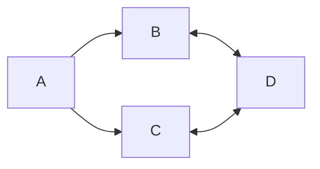
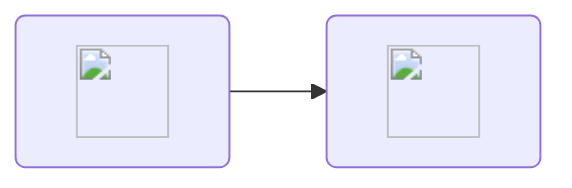

# SoftwareArchectureDrawnings
Repository for developing SoftwareAchectureDrawnings

```mermaid
flowchart LR 
    A --> B & C <--> D
```

```mermaid
graph LR
    %% Database One Comment
    DB("<img src='https://raw.githubusercontent.com/baudekin/SoftwareArchectureDrawnings/main/icons/aws/Resource-Icons_01312023/Res_Database/Res_48_Dark/Res_Amazon-Aurora-MySQL-Instance_48_Dark.svg'; width='48' height='48' />") -->
    DB1("<img src='https://raw.githubusercontent.com/baudekin/SoftwareArchectureDrawnings/main/icons/aws/Resource-Icons_01312023/Res_Database/Res_48_Dark/Res_Amazon-Aurora-MySQL-Instance_48_Dark.svg'; width='48' height='48' />")
```
